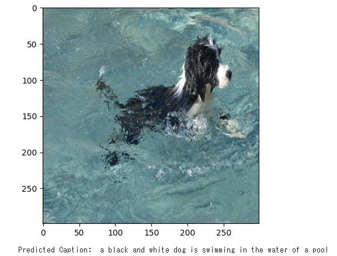
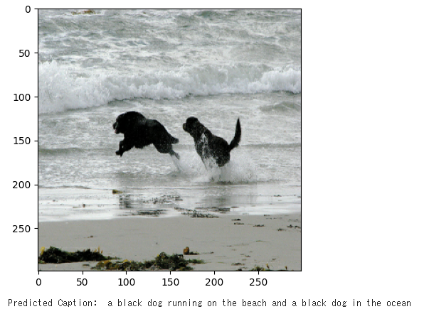
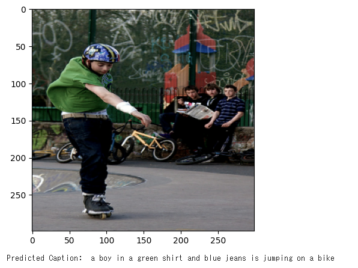

# image-captioning-keras
Test image captioning from [keras-io](https://github.com/keras-team/keras-io)

Please refer to [image_captioning.ipynb](./image_captioning.ipynb)

## output
### # 1

### # 2

### # 3
